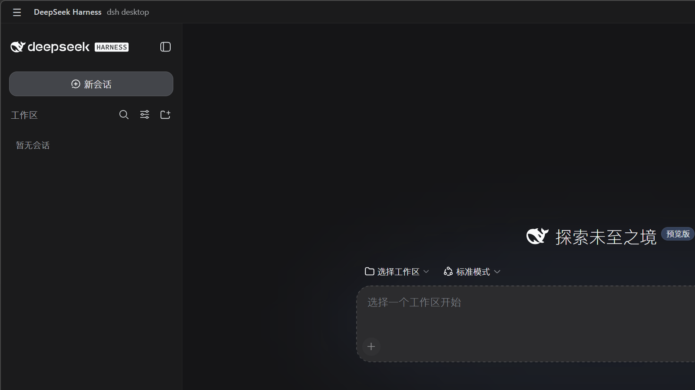
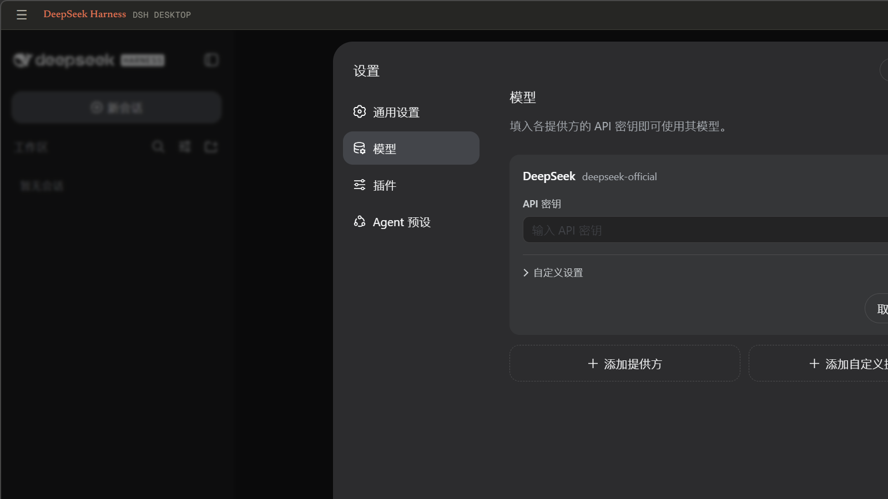
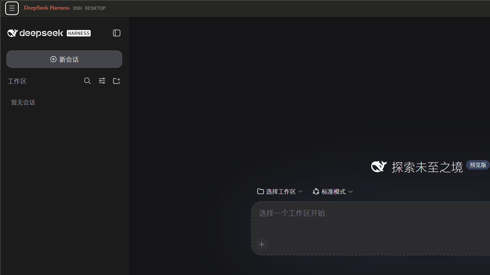

# DeepSeek Harness Desktop

[English](README.md) | 中文

<div align="center">

[](https://github.com/SANS41478/deepseek-harness-desktop/releases/latest)
[](https://github.com/SANS41478/deepseek-harness-desktop/actions/workflows/desktop-release.yml)
[](LICENSE)

**完整的 [DeepSeek Harness](https://github.com/deepseek-ai/deepseek-harness) Web UI——会话、工具调用、审批、工作区——装进一个原生桌面窗口。无需终端，无需另起服务。**



**[⬇ 下载最新安装包](https://github.com/SANS41478/deepseek-harness-desktop/releases/latest)** · [反馈问题](https://github.com/SANS41478/deepseek-harness-desktop/issues)

</div>

> [deepseek-ai/deepseek-harness](https://github.com/deepseek-ai/deepseek-harness) 的**社区维护**伴生项目——非 DeepSeek AI 官方产品。本仓库在上游 harness 的基础上新增了桌面壳（`apps/desktop/`），其余部分跟随上游。

## 为什么要桌面端？

- **一键启动**——安装包、应用图标、原生窗口。harness 在应用内启动：不需要单独起服务，也没有需要管理的进程。
- **原生集成**——系统托盘、应用菜单、系统文件对话框、窗口内标题栏，以及基于 `electron-updater` 的自动更新。
- **与 CLI 共享状态**——读取与 `dsh` 相同的 `$DSH_HOME`：会话、设置、profile 开箱即通。
- **完整复用 Web 前端**——约 30 个 UI 插件（会话投影、工具调用树、审批、设置）原样复用；桌面端只替换了渲染层与 harness 之间的*载体*：

| Transport | 渲染层 | 载体 | 如何启用 |
|---|---|---|---|
| `loopback`（默认） | 经 `http://127.0.0.1:<port>` 加载 dist | 与浏览器完全一致的 HTTP `/api` + WebSocket | 无需任何配置 |
| `ipc` | 经 `dsh://` 协议加载 dist | preload 桥（`dshApi`） | `DSH_DESKTOP_TRANSPORT=ipc` |

两种模式都在 Electron 主进程内启动同一棵 harness 树（与 CLI 相同的 profile 分层和 fail-loud 守卫）。架构细节见 [apps/desktop/README.md](apps/desktop/README.md)。

## 安装

**Windows**——从[最新 Release](https://github.com/SANS41478/deepseek-harness-desktop/releases/latest) 下载 `DeepSeek-Harness-Desktop-<version>-win-x64.exe` 运行即可（按用户安装的 NSIS 安装包）。

> 当前构建**未签名**：Windows SmartScreen 会提示"未知发布者"，在签名版本发布前，"更多信息 → 仍要运行"属预期操作。

**macOS**——请从源码构建（DMG/ZIP 目标已配置，见下文「开发」一节）。

**首次启动**：按提示填入 DeepSeek API Key（或在 `$DSH_HOME/settings.yaml` 配置自己的模型），选择一个工作区即可开始——与 `dsh web` 完全一致，[Web UI 指南](docs/user/guide/index.md)同样适用。

| 模型提供方 | Claude 壳主题 |
|---|---|
|  |  |

## 开发

需要 `Node.js` 与 `pnpm`：

```sh
git clone https://github.com/SANS41478/deepseek-harness-desktop.git
cd deepseek-harness-desktop
pnpm install
pnpm build                                           # host libs + web frontend
pnpm --filter @deepseek-ai/dsh-desktop dev           # loopback transport (default)
DSH_DESKTOP_TRANSPORT=ipc pnpm --filter @deepseek-ai/dsh-desktop dev
pnpm --filter @deepseek-ai/dsh-desktop package:win   # NSIS installer → apps/desktop release dir
```

发布文档：[apps/desktop/README.publish.md](apps/desktop/README.publish.md)（[中文](apps/desktop/README.publish.zh.md)）。版本 tag 会自动触发 [`desktop-release` 工作流](.github/workflows/desktop-release.yml)发版。

## 关于 harness 本体

[DeepSeek Harness](https://github.com/deepseek-ai/deepseek-harness)（`dsh`）是 [DeepSeek AI](https://deepseek.com) 开发的开源 agent harness（智能体框架），**一切皆插件**，由 [Cordis](https://github.com/cordiverse/cordis) 驱动。目前处于开发者预览阶段、快速迭代——可能出现破坏兼容性的变更。不装桌面壳、直接跑 Web UI：`npx @deepseek-ai/dsh web`。上游文档：[开发指南](docs/development.md) · [架构](docs/architecture.md)。

## 社区

- 桌面端——bug 与功能建议：[Issues](https://github.com/SANS41478/deepseek-harness-desktop/issues) · [Discussions](https://github.com/SANS41478/deepseek-harness-desktop/discussions)
- 上游 harness：[Discussions](https://github.com/deepseek-ai/deepseek-harness/discussions) · [Discord](https://discord.gg/Ycq5dCaS4) · 插件可见性：给你的插件仓库加上 [`dsh-plugin`](https://github.com/topics/dsh-plugin) topic

## 参与贡献

见 [CONTRIBUTING.md](CONTRIBUTING.md)。

## 许可证

[MIT](LICENSE)——第三方依赖及其许可证见 [THIRD_PARTY_NOTICES.md](THIRD_PARTY_NOTICES.md)。
